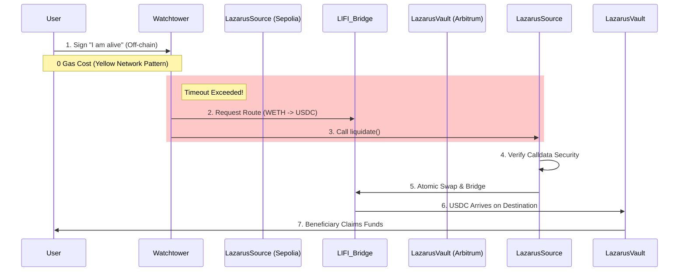

# Lazarus Protocol

**A decentralized, cross-chain dead man's switch for secure asset evacuation.**

## The Problem
In the event of user inactivity, catastrophic events, or loss of access, just like in the case of Satoshi Nakamoto, digital assets often remain stranded in "dead" wallets. Existing on-chain switches are often limited to a single network, leaving assets vulnerable if the source chain becomes congested or inaccessible. Manual transfers are impossible, and custodial solutions require trusting third parties.

## The Solution: Lazarus Protocol
Lazarus provides a decentralized insurance policy for digital assets. It monitors user liveness on an active "Source" chain (Sepolia for this prototype) and, upon detecting prolonged inactivity, automatically evacuates funds to a secure "Vault" on a "Destination" chain (Arbitrum Sepolia for this prototype).

### Protocol Lifecycle
1.  **Registration**: Users register on `LazarusSource` and define a beneficiary using their **ENS name or address** and a custom **Inactivity Period** (ranging from 3 days to 1 year).
2.  **Off-Chain Handshake**: Users sign EIP-712 "Heartbeat" messages. These are sent to the **Watchtower** and verified off-chain using **Yellow Network Sessions**, ensuring 0% gas cost for liveness proofs.
3.  **Autonomous Liquidation**: If the Watchtower detects that the last heartbeat exceeds the user's cooldown, it fetches an optimized swap-and-bridge route from **LI.FI**.
4.  **Cross-Chain Settlement**: The Watchtower executes the `liquidate` call on L1. Funds are swapped to L2 USDC and bridged to the `LazarusVault`.
5.  **Beneficiary Recovery**: The designated beneficiary claims the funds from the Vault on the destination chain.

---

## Technical Architecture

The protocol is designed with a **Separation of Concerns** between liveness tracking and asset execution.

### 1. Decoupled Liveness Pattern (Yellow Network inspired)
The heartbeat logic is entirely decoupled from the blockchain. We use a **Session-based Logic** where valid signatures represent proof-of-life. This state is settled on-chain only during a liquidation event. This architecture allows for sub-minute heartbeat resolution without incurring any on-chain load.

### 2. LI.FI Diamond Delegation
The `LazarusSource` contract does not implement specific bridge or DEX logic. Instead, it interacts with the **LI.FI Diamond**. This makes the protocol future-proof: it can support any asset or bridge that LI.FI supports without a contract upgrade.

### 3. Distributed Vaulting
Assets landing on the destination chain are held in a **Multi-User Vault**. This prevents funds from being "lost" if a beneficiary's wallet isn't immediately ready or if the destination chain gas is high at the time of arrival.

### 4. Yellow Network "Proof of Life" State Channels
We utilized Yellow Network's architecture to solve the "Gas Problem" of dead man's switches. Instead of on-chain heartbeats, users sign EIP-712 intents off-chain. The Watchtower aggregates these signatures and acts as a Solver, settling the state on-chain only when necessary (during pingFor or liquidation). This allows for high-frequency liveness checks with zero gas cost to the user.

### 5. Calldata "Deep Packet" Inspection (Security)
We do not blindly trust the bridge. To prevent a compromised Watchtower from routing funds to a malicious address, the LazarusSource contract implements a custom Solidity loop that scans the raw LI.FI calldata bytes. It verifies that the user's registered beneficiary address is physically present in the transaction payload before execution, preventing redirection attacks.

### 6. Omni-Liquidation Engine
Standard liquidators often fail if a user has funds split between wallet allowances and contract deposits. Our protocol calculates a Dynamic Balance Sheet at the moment of liquidation. It aggregates userDeposits (internal balance) + allowance (external wallet balance) and bridges the total sum in a single atomic transaction, ensuring zero dust is left behind.

---

## Threats & Mitigations

We have analyzed the primary threats to an autonomous cross-chain protocol and implemented the following mitigations:

### 1. Gas Wars & L1 Congestion
**Threat**: High gas prices on the Source chain could prevent the Watchtower from calling `liquidate` in time, stalling the evacuation.
**Mitigation**: The Watchtower service implements **Dynamic Fee Management**. It monitors `baseFee` and `priorityFee` to ensure transactions are included even during spikes. Furthermore, users are encouraged to set a multi-day cooldown for mainnet use, providing an ample window for the Watchtower to land the transaction.

### 2. Watchtower Centralization / Downtime
**Threat**: Watchtower Centralization / Downtime
**Mitigation**: The current prototype uses a trusted Watchtower for automated execution. However, the system is designed for Progressive Decentralization. In future versions, the `onlyWatchtower` modifier will be replaced with a signature verification logic, allowing any keeper network (like Gelato or Chainlink Automation) to execute the liquidation by presenting the signed "dead" status, ensuring the protocol cannot be censored.

### 3. Signature Replay & Malleability
**Threat**: An attacker could reuse an old heartbeat to "resurrect" a dead user.
**Mitigation**: Every heartbeat signature includes a **unique, incrementing nonce** and a timestamp. The Watchtower and contracts verify these against previously stored nonces to prevent replay attacks.

### 4. Bridge Default / Liquidity Risk (Yellow/LI.FI Solution)
**Threat**: LI.FI might fail to find a route or a bridge might be compromised.
**Mitigation**: By using LI.FI as a **Liquidity Aggregator** and tapping into **Yellow Liquidity Pools**, the protocol is not dependent on any single bridge or DEX. If one path is blocked, the protocol automatically routes through the deepest available liquidity, ensuring the evacuation path remains open.

---

## Deployment Addresses

| Contract | Network | Address |
|----------|---------|---------|
| **LazarusSource** | Sepolia (L1) | `0x8369982044107232355498c7c16f648f159a3098` |
| **LazarusVault** | Arbitrum Sepolia (L2) | `0x63510d487ef6a1cfe2a838b925fcbc771cc32e98` |

---

## Technologies Integrated
- **LI.FI Orchestration**: Cross-Chain execution and liquidity layer [(LIFI.md)](./LIFI.md)
- **Yellow Network Sessions**: Off-chain session logic for Gas-Free Heartbeats [(YELLOW.md)](./YELLOW.md)
- **ENS Resolution**: Human-readable beneficiary resolution [(ENS.md)](./ENS.md)

---

## License
[CC BY-NC-ND 4.0](./LICENSE)
